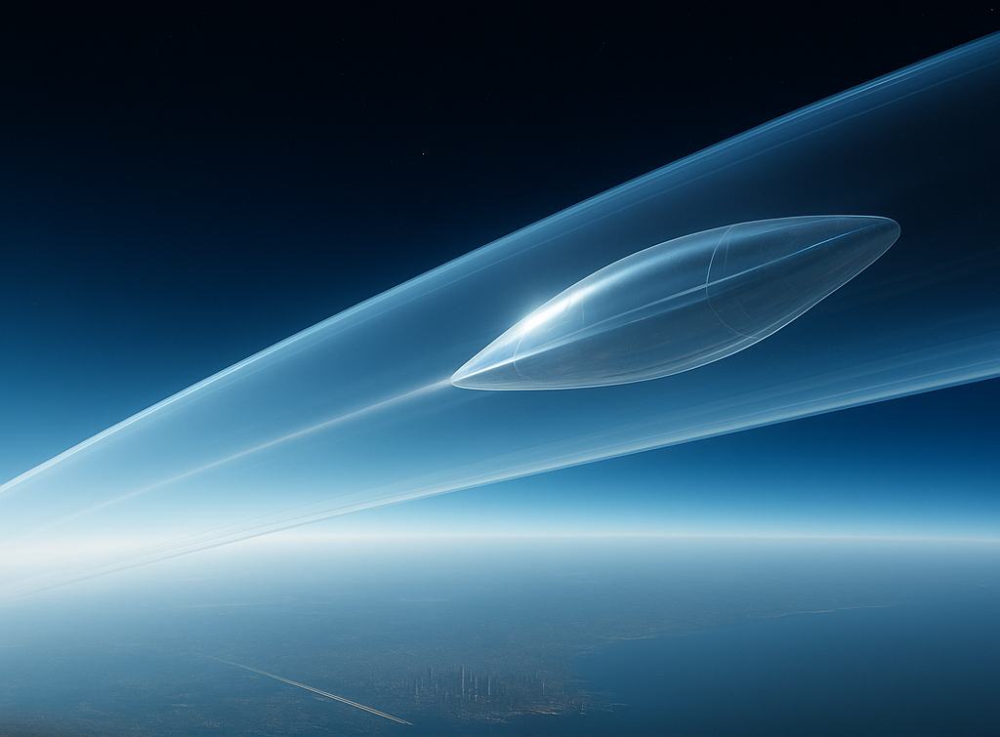

# Skyloop  

  

Skyloop is a vision for a buoyant, near‑vacuum sky transport system connecting major cities via stratospheric corridors. By suspending lightweight tubes high above the weather for launching and linearly accelerating small gliders inside them, Skyloop aims to deliver intercity travel at Mach 2–6 speeds with energy efficiency and throughput orders of magnitude better than current aviation.  

## Documents  

- [docs/01-overview.md](docs/01-overview.md): overview of the concept, network design, advantages, and pod classes.  
- [docs/02-architecture.md](docs/02-architecture.md): architecture covering route & network topology, tube structure, stations, and pod design.  
- [docs/03-unit-economics.md](docs/03-unit-economics.md): unit economics analysis including capital and operating costs, capacity, and throughput.  
- [docs/04-roadmap.md](docs/04-roadmap.md): roadmap of development phases from demonstrator to global network.
- [docs/05-market.md](docs/05-market.md): summarizes potential cargo markets for the early phases of Skyloop's deployment.
- [docs/06-r-and-d.md](docs/06-r-and-d.md): initial R&D, focusing on a tabletop-scale prototype to study near-vacuum transport physics.
